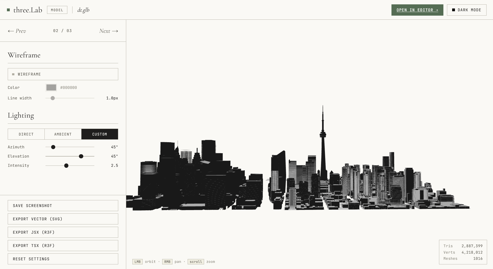
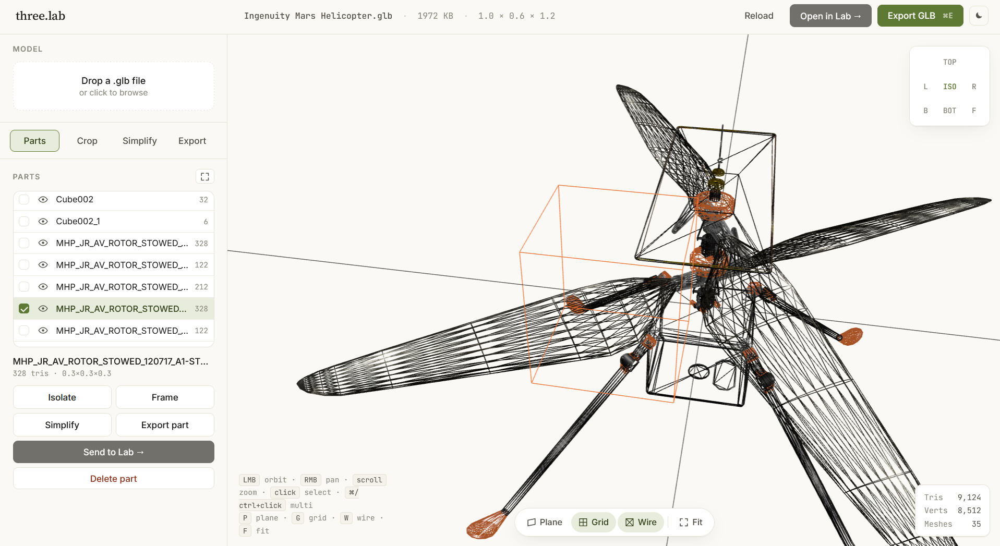

# three.lab

  

three.lab, a three.js tool for viewing and making basic edits to 3D models and textures.

I am terrible at Blender and this is much faster for what I actually need. It started as a byproduct of my interactive React Three Fiber project [Cassini](https://github.com/snes19xx/Cassini) and I figured it was worth splitting out as its own thing.

#### Lab (`index.html`)

The main viewer.

**Texture mode** : drop a JPG, PNG, WEBP, or KTX2 image and it wraps onto a sphere. You get material controls (roughness, metalness, normal map scale), an atmospheric glow effect with color and intensity controls, a lat/lon coordinate readout that follows your cursor across the surface, a graticule grid, and pole markers.

**Model mode** : drop a GLB or GLTF and it loads the full mesh with a triangle, vertex, and mesh count overlay.

Both modes share:

- Lighting : direct, ambient, or fully custom with azimuth, elevation, and intensity sliders
- Wireframe overlay with color picker and line weight
- Auto-rotation with speed and axial tilt controls
- Dark and light theme (remembered between sessions)
- Screenshot export
- Reset button that puts everything back to defaults

Model mode also lets you export the current view as an SVG vector, or generate a React Three Fiber component (JSX or TSX) that you can drop straight into a project.

#### Editor (`editor.html`)

Where you make actual geometry edits to a GLB. The side panel is split into three tabs.

**Parts** : a live outliner of every mesh in the model. Click a part in the viewport or the list to select it; ctrl/⌘-click or the row checkboxes to select several. With a selection you can isolate it (hide everything else), frame it, simplify it, delete it, export it as its own `.glb`, or send it straight to the Lab. The panel has a maximize button that widens and heightens the list for long part names.

**Crop** : position a cut plane in 3D space using X/Y/Z position and rotation sliders, choose which side to keep, and apply. The plane snaps to any axis, and a normal arrow shows which side survives before you commit. The crop discards every triangle on the unwanted side. Apply multiple crops in sequence, undo each individually (up to 12 steps back), or reload the original. Export the result as a `.cropped.glb`.

**Simplify** : decimate the whole model by a reduction percentage.

The two tools are connected through IndexedDB, without file picker. From the Lab, "Open in Editor →" sends the current model over. From the Editor, "Open in Lab →" sends the whole edited model back, and "Send to Lab →" sends just the selected parts (shown as a wireframe).

### File overview

| Path                    | What it does                                              |
| ----------------------- | --------------------------------------------------------- |
| `index.html`            | Lab viewer entry point                                    |
| `editor.html`           | Editor entry point                                        |
| `src/lab/main.js`       | Lab UI event wiring and render loop                       |
| `src/lab/scene.js`      | Three.js scene, camera, renderer, sphere, atmosphere      |
| `src/lab/loaders.js`    | GLB and texture loading                                   |
| `src/lab/export.js`     | Screenshot, SVG export, R3F code generation               |
| `src/lab/wireframe.js`  | Custom wireframe overlay                                  |
| `src/lab/lighting.js`   | Light mode presets and custom positioning                 |
| `src/lab/state.js`      | Shared Lab application state                              |
| `src/editor/main.js`    | Editor geometry, parts, crop, UI, and export logic        |
| `src/editor/tabs.js`    | Editor sidebar tab switching                              |
| `src/shared/handoff.js` | Passes model buffers between Lab and Editor via IndexedDB |
| `styles/lab.css`        | Lab styles                                                |
| `styles/editor.css`     | Editor styles                                             |

  

