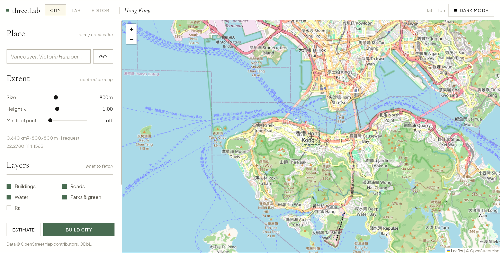

# three.lab

  

three.lab, a three.js tool for viewing and making edits to 3D models and textures.

I am terrible at Blender and this is much faster for what I actually need. It started as a byproduct of my interactive React Three Fiber project [Cassini](https://github.com/snes19xx/Cassini) and I figured it was worth splitting out as its own thing.

#### City (`index.html`)

  

The landing page. Builds a real 3D model of anywhere on Earth from OpenStreetMap, with no account, key, or install.

Search for a place (or just pan the map), set the extent with a single size slider, pick which layers you want, and hit build. Building footprints are pulled from Overpass, projected onto a local metre grid, triangulated and extruded to their tagged height : `height` in metres or feet, falling back to `building:levels`, falling back to a sensible default for the building type. Multipolygons keep their courtyards, and relations whose outlines are split across several ways get stitched back into closed rings. Roads and rail become mitred ribbons scaled by class and lane count; water and parks come through as flat layers.

The result is a single GLB you can open in the Lab, send straight to the Editor, or download. Buildings are split into named height bands (`Buildings · 30–60m` and so on) and roads into major/minor, so the model arrives with a meaningful parts list already in place for the Editor's outliner.

- `Height ×` exaggerates or flattens the skyline; the height bands follow the scaled geometry
- `Min footprint` drops sheds and garages so you keep only the buildings that read
- `Estimate` runs a count-only query first, so you know what you're asking for before you ask for it

Anything larger than about a square kilometre is fetched as a grid of tilest. Overpass serves several small queries far more reliably than one large one ( 1.44 km² of Manhattan comes down in four tiles in about 23 seconds, where a single query over a fraction of that area can take a minute or time out outright) Ways crossing a tile seam are de-duplicated by id and keep their full geometry, so buildings never end up cut in half. Every request carries a hard client-side deadline and falls through to a mirror, and the whole build is cancellable with the button or Esc.

#### Lab (`lab.html`)

The main viewer.

**Texture mode** : drop a JPG, PNG, WEBP, or KTX2 image and it wraps onto a sphere. You get material controls (roughness, metalness, normal map scale), an atmospheric glow effect with color and intensity controls, a lat/lon coordinate readout that follows your cursor across the surface, a graticule grid, and pole markers.

**Model mode** : drop a GLB or GLTF and it loads the full mesh with a triangle, vertex, and mesh count overlay.

Both modes share:

- Lighting : direct, ambient, or fully custom with azimuth, elevation, and intensity sliders
- Wireframe overlay with color picker and line weight
- Auto-rotation with speed and axial tilt controls
- Dark and light theme — follows your OS until you toggle it, then remembered across sessions and shared by all three pages
- Screenshot export
- Reset button that puts everything back to defaults

Model mode also lets you export the current view as an SVG vector, or generate a React Three Fiber component (JSX or TSX) that you can drop straight into a project.

#### Line art (hidden-line removal)

In the Lab, `Line art` runs a real hidden-line engine over whatever you are currently looking at, and gives you back clean vector drawing --the front of the building

- **Edge extraction.** Geometry is welded into a shared topology first, since GLB meshes are often non-indexed and coincident vertices need to be matched. Edges are then classified as silhouettes, creases, open boundaries, or material seams. Interior tessellation edges are discarded.

- **Occlusion.** Candidate edges are tested against the triangles covering them using a screen-space uniform grid with DDA traversal. Edges are split where they cross an occluder's plane, so each piece is entirely in front of or behind it. This gives exact visibility than just sampling. Perspective is handled correctly since screen position is not linear in the 3D edge parameter.

- **Chaining.** Visible fragments are joined into continuous polylines and collinear segments are merged. This reduces thousands of individual segments to a few hundred paths, so the plotter can draw an outline in one continuous stroke instead of repeatedly lifting the pen.

The output can be **SVG**, a **600 dpi PNG**, **HPGL**, or **G-code** for direct pen-plotter use.

The PNG is sized so its long edge prints at 297 mm _7016 px at 600 dpi_ and includes a `pHYs` chunk declaring the resolution.

#### Editor (`editor.html`)

Where you make actual geometry edits to a GLB. The side panel is split into three tabs.

**Parts** : a live outliner of every mesh in the model. Click a part in the viewport or the list to select it; ctrl/⌘-click or the row checkboxes to select several. With a selection you can isolate it (hide everything else), frame it, simplify it, delete it, export it as its own `.glb`, or send it straight to the Lab. The panel has a maximize button that widens and heightens the list for long part names.

**Crop** : position a cut plane in 3D space using X/Y/Z position and rotation sliders, choose which side to keep, and apply. The plane snaps to any axis, and a normal arrow shows which side survives before you commit. The crop discards every triangle on the unwanted side. Apply multiple crops in sequence, undo each individually (up to 12 steps back), or reload the original. Export the result as a `.cropped.glb`.

**Simplify** : decimate the whole model by a reduction percentage.

The two tools are connected through IndexedDB, without file picker. From the Lab, "Open in Editor →" sends the current model over. From the Editor, "Open in Lab →" sends the whole edited model back, and "Send to Lab →" sends just the selected parts (shown as a wireframe).

### File overview

| Path                        | What it does                                              |
| --------------------------- | --------------------------------------------------------- |
| `index.html`                | City builder entry point (landing page)                   |
| `lab.html`                  | Lab viewer entry point                                    |
| `editor.html`               | Editor entry point                                        |
| `src/city/main.js`          | Map, extent picking, progress and hand-off                |
| `src/city/overpass.js`      | Overpass client: tiling, timeouts, mirrors, geocoding     |
| `src/city/build.js`         | OSM elements to extruded Three.js geometry                |
| `src/city/tags.js`          | Height, width and classification from OSM tags            |
| `src/city/geo.js`           | Lat/lon to a local metre grid, ring winding helpers       |
| `src/lab/main.js`           | Lab UI event wiring and render loop                       |
| `src/lab/scene.js`          | Three.js scene, camera, renderer, sphere, atmosphere      |
| `src/lab/loaders.js`        | GLB and texture loading                                   |
| `src/lab/export.js`         | Screenshot, SVG export, R3F code generation               |
| `src/lab/lineart.js`        | Line art panel: preview, controls, export                 |
| `src/lab/hlr/index.js`      | Three.js adapter for the hidden-line engine               |
| `src/lab/hlr/topology.js`   | Vertex welding and edge adjacency                         |
| `src/lab/hlr/classify.js`   | Silhouette / crease / boundary / material edges           |
| `src/lab/hlr/occlude.js`    | The hidden-line removal itself                            |
| `src/lab/hlr/chain.js`      | Joins fragments into polylines, collapses collinear runs  |
| `src/lab/hlr/output.js`     | SVG, HPGL and G-code serialisers                          |
| `src/lab/hlr/raster.js`     | 600 dpi PNG rendering, with real density metadata         |
| `src/lab/wireframe.js`      | Custom wireframe overlay                                  |
| `src/lab/lighting.js`       | Light mode presets and custom positioning                 |
| `src/lab/state.js`          | Shared Lab application state                              |
| `src/editor/main.js`        | Editor geometry, parts, crop, UI, and export logic        |
| `src/editor/tabs.js`        | Editor sidebar tab switching                              |
| `src/shared/handoff.js`     | Passes model buffers between Lab and Editor via IndexedDB |
| `src/shared/theme.js`       | Theme resolution shared by all three pages                |
| `src/shared/attribution.js` | The credit stamped onto exported images and code          |
| `styles/lab.css`            | Palette, type scale and shared panel styles               |
| `styles/city.css`           | City-specific components (map, dock, overlays)            |
| `styles/nav.css`            | Tool navigation shared by all three pages                 |
| `styles/editor.css`         | Editor styles                                             |

  

